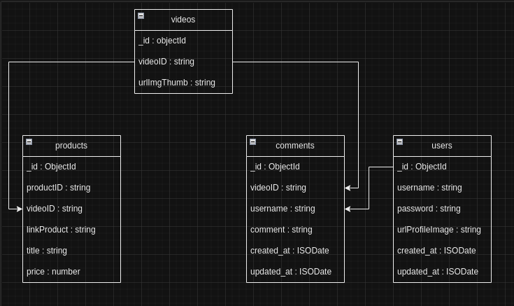
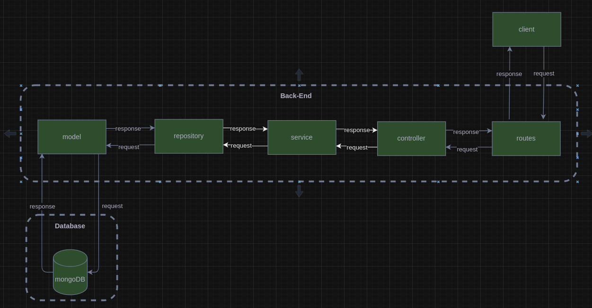

# Tokopedia Play Clone - Back-End

A Web Service built using Node.js with Express Framework and RESTful API with jwt token and using MongoDB Database and using Docker to Deploy into Server.

---

## How to Run
You can access production using url below

- Backend: [http://103.185.193.30:4000](http://103.185.193.30:4000)
- Backend + Frontend: [http://103.185.193.30:3000](http://103.185.193.30:3000)
- Docker Image: `docker pull drlkhsn/gigih-backend:2.0`

### Requirements
Be sure to complete the following requirements
- `node.js v18.16.1`
- `npm v9.5.1`
- `mongodb v6.0.8`

### Configuration
1. Open terminal and Clone project from [https://github.com/darul-eng/gg3-final-project-backend.git](https://github.com/darul-eng/gg3-final-project-backend.git)
2. Make sure you are at the root of the project. if not, you can use the command `cd destionation_path`
3. Run command `npm install` to install all dependencies.
4. Make file `.env` file following the `.env-example` and fill in each variable according to your needs.
5. Make sure mongodb is running and Run command `npm start` to start application using nodemon.
6. Run command `node seed` to seed data into your database
7. Web Service Ready to use

---

## Explanation of Database Structure
### Collection
There are 4 collections called videos, products, comments, and users. Videos contain a list of videos and their thumbnail url. then the product stores product detail data belonging to the video so that the product collection has a videoID. Same with products, comments also store comments belonging to videos.




To improve the performance of each collection implements indexing. Collection videos indexes the videoID, Collection products indexes the videoID and productID, Collection comments indexes the videoID, 

### videos

- Description: Store Information about list videos in application
  - Document Structure:
    ```
    {
      _id: ObjectId(auto-generate),
      videoID: {string, required, unique},
      urlImgThum: {string, required}
    }
    ```
### products

- Description: Store Information about list product from video in application
  - Document Structure:
    ```
    {
      _id: ObjectId(auto-generate),
      productID: {string, required},
      videoID: {string, required, unique},
      linkProduct: {string, required},
      title: {string, required},
      price: {number, required},
    }
    ```
### comments

- Description: Store Information about list comment from video in application
  - Document Structure:
    ```
    {
      _id: ObjectId(auto-generate),
      videoID: {string, required, unique},
      username: {string, required},
      comment: {string, required},
      timestamp: (auto-generate)
    }
    ```
---


## Explanation of API Structure

This application is built using N-Architecture which focuses on separation of concern and Single Responsibility Principle which means dividing a complex code into several layers according to their own responsibilities so that it is more modular, more flexible, scalable, easy to maintain, easy to test, and debugging.



#### At the `root` of this application
- there is an `.env-example` file to set the value of the environment variable;
- there is a `seed.js` file used to seed data to the database;
- there is a `Dockerfile` file used to make docker image;
- and there is the `src` folder as the first step to enter another folder structure. In the `src` folders there are several folders, namely, `controller`, `service`, `repository`, `model`, `routes`, `config`, `helper`, and `validation`

#### In the `src` folder
- there is the main file, `app.js`, to define the server, call the router, and call the database connection.
- there is a `controller` folder containing files that are responsible for handling requests, request validation, error handling, response handling, and interacting with the service layer,
- there is a `service` folder containing files that are responsible for managing the core logic of the application, business rules implementation, processing data from the controller or from the repository, interacting with repository,
- there is a `repository` folder containing files responsible for data access, transaction management, and data retrieval.
- there is a `model` folder, in which there are files named based on the domain. These files are responsible for defining the schema of each domain.
- there is a `routes` folder that is responsible for storing application routes that will later be called by app.js
- there is a `middleware` folder that is responsible for intercept routes that will check authentication user
- there is an `config` folder there is a database file that is used to create a connection to the database that will be called by app.js
- there is a `helper` folder that is responsible for storing functions that can support the utility of the application
- there is a `validation` folder containing files that are responsible for validating input requests.

---

## List API Request and Response


### 1. Sign Up
#### POST `/api/v1/users/signup`

#### Description: Register new User.

* **URL Params**  
  `None`
* **Data Params / body**  
    ```
    {
      username: {string, required},
      password: {string, required}
    }
  ```
* **Headers**  
  `Content-Type: application/json`


* **Success Response:**
* **Code:** `200`  
  **Response:**
  ```
  {
    message: "Success",
    status: 200,
    data: 
      {
        username: string,
        urlProfileImage: string
      }
  }
  ```

### 2. Sign In
#### POST `/api/v1/users/signin`

#### Description: Authenticate User.

* **URL Params**  
  `None`
* **Data Params / body**
    ```
    {
      username: {string, required},
      password: {string, required}
    }
  ```
* **Headers**  
  `Content-Type: application/json`

* **Success Response:**
* **Code:** `200`  
  **Response:**
  ```
  {
    message: "Success",
    status: 200,
    data: 
      {
        username: string,
        urlProfileImage: string,
        token: string
      }
  }
  ```

### 3. Get list video
#### GET `/api/v1/videos`

#### Description: Returns all video in the application.

* **URL Params**  
  `title=title_product`
* **Data Params / body**  
  `None`
* **Headers**  
  `Content-Type: application/json`


* **Success Response:**
* **Code:** `200`  
  **Response:**
  ```
  {
    message: "Success",
    status: 200,
    data: [
      {
        videoId: string,
        urlImgThumn: string
      },
      {
        videoId: string,
        urlImgThumn: string
      }
      ....
    ]
  }
  ```

### 4. Get all products belonging to video
#### GET `/api/v1/videos/:id/products`
#### Description: Returns all product belonging to video in the application.

* **URL Params**  
  *Required:* `id=[string]`
* **Data Params / body**  
  `None`
* **Headers**  
  `Content-Type: application/json`

  `Accept: application/json`


* **Success Response:**
* **Code:** `200`  
  **Response:**
  ```
  {
    message: "Success",
    status: 200,
    data: [
      {
        productID: string,
        linkProduct: string,
        title: string,
        price: number
      },
      {
        productID: string,
        linkProduct: string,
        title: string,
        price: number
      },
      ....
    ]
  }
  ```
* **Error Response:**
* **Code:** `404`  
  **Content:**
  ```
  {
    message: "video id is not found",
    status: 404
  }
  ```  

### 5. Get all comments belonging to video
#### GET `/api/v1/videos/:id/comments`
#### Description: Returns all comment belonging to video in the application.
* **URL Params**  
  *Required:* `id=[string]`
* **Data Params / body**  
  `None`
* **Headers**  
  `Content-Type: application/json`

  `Accept: application/json`


* **Success Response:**
* **Code:** `200`  
  **Response:**
  ```
  {
    message: "Success",
    status: 200,
    data: [
      {
        username: string,
        comment: string,
        created_at: date,
        updated_at: date
      },
      {
        username: string,
        comment: string,
        created_at: date,
        updated_at: date
      },
      ....
    ]
  }
  ```
* **Error Response:**
* **Code:** `404`  
  **Content:**
  ```
  {
    message: "video id is not found",
    status: 404
  }
  
  ```  

### 6. Create a comments for the video
#### POST `/api/v1/videos/:id/comments`
#### Description: insert a comment for the video in the application.
* **URL Params**  
  *Required:* `id=[string]`
* **Data Body**  
  ```
    {
      username: {string, required},
      comment: {string, required}
    }
  ```
* **Headers**  
  `Content-Type: application/json`

  `Accept: application/json`


* **Success Response:**
* **Code:** `200`  
  **Response:**
  ```
  {
    message: "Success",
    status: 201
  }
  ```
* **Error Response:**
* **Code:** `400`  
  **Content:**
  ```
  {
    message: "username is not allowed to be empty",
    status: 400
  }
  
  ```  
  
  #### or
  
  ```
  {
    message: "comment is not allowed to be empty",
    status: 400
  }
  
  ```  

---

